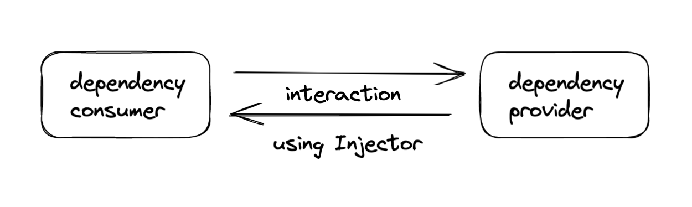
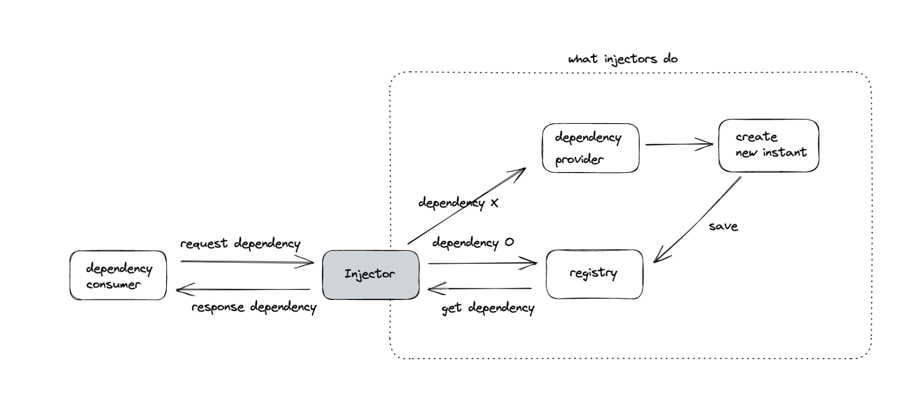

## DI & Angular DI

백엔드 개발자와 한 번 대화를 한적이 있는데, Dependency Injection에 대한 이야기였다. 그 분은 Dependency Injection이 무엇인지에 대해 나에게 설명해보라고 하셨고, _“나는 컴포넌트가 주입된 클래스를 생성하는 방법을 몰라도 사용이 가능하기 때문에 테스트가 용이하고, 디펜던시가 직접 걸려져있는 것이 아니기 때문에 어디에서든지 사용이 가능하다…”_ 는 식으로 말했던 것 같다.

그런데, 그 분은 단 한마디로 정의해주셨는데, **DI는 결국 다형성을 위한 것**이라고 말씀하시는 것을 듣고, 내가 DI에 대해서 명확하게 모르고 있구나 라는 생각을 하게 되었다.
Angular에서 DI를 사용을 하고 있지만, 그 클래스의 인스턴스를 주입시키는 부분은 Angular가 직접해주고 있기 때문에 다형성의 장점에 대해서 인지하지 못하고 있었던게 아닐까 싶다.

그래서 오늘은 DI에 대해 다시 한번 알고있는 내용을 정리해보고, Angular의 내부 DI 방식도 정리해보려한다.

---

### Dependency Injection

클래스 내부에서 생성하고있던 인스턴스를 외부에서 주입시킴으로써 클래스의 재사용성을 높힐 수 있다.

```
// not DI pattern
interface Cake {
	kind: string;
	packageBox: () => Cake;
	isPackage: boolean;
	...
}

interface Bread {
	kind: string;
	packageBox: () => Bread;
	isCream: boolean;
}

class Baker {
	bake() {
		const cake = new Cake();
		cake.packageBox();
		console.log('can sell cake');
	}


}

class Main {
	init() {
		const baker = new Baker();
		baker.bake(); // 케이크밖에 못 만듦...
	}
}
```

```
// DI pattern
interface BakeFood {
	kind: string;
	packageBox: () => BakeFood;
}

class Baker {
	bake(bakeFood: BakeFood) { // <- 외부에서 주입, DI
		cake.packageBox();
		console.log('can sell cake');
	}


}

class Main {
	init() {
		const baker = new Baker();
		const cake = new Cake();
		baker.bake(cake); // BakeFood 인터페이스에 맞는 타입을 가진 클래스는 전부 만들수 있음 (다형성)
	}
}
```

### Angular DI 방식

Angular에서 애플리케이션을 위한 injector는 부트스트랩되는 동안 자동으로 생성된다. injector는 서비스나 값이 필요할 경우, provider를 사용하여 의존성을 인스턴스화한다.

- DI system: dependency consumer, dependency provider
  
  Angular는 추상화된 Injector를 사용하여 dependency consumer와 dependency provider 사이의 인터렉션을 가능하게 한다.

- Injector가 하는 일
  
  dependency가 consumer에 의해 요청되면, Injector는 registry에서 사용 가능한 인스턴스가 이미 있는지 확인하고, 만약 없다면 새로운 인스턴스가 생성된 후 registry에 저장된다.

- Angular는 애플리케이션이 부트스트랩 되는동안, root injector라고 알려진 애플리케이션 전체의 injector를 생성한다. 필요에 따라 다른 injector도 생성될 수도 있다.

- 대게 수동으로 injector를 생성할 필요는 없지만, provider와 consumer가 연결되는 계층이 있다는 것은 인지하고 있어야한다.

- Angular는 service 뿐만 아니라, function, object, string(primitive type), boolean(primitive type)… 등 모든 타입에 의존성을 허용한다
