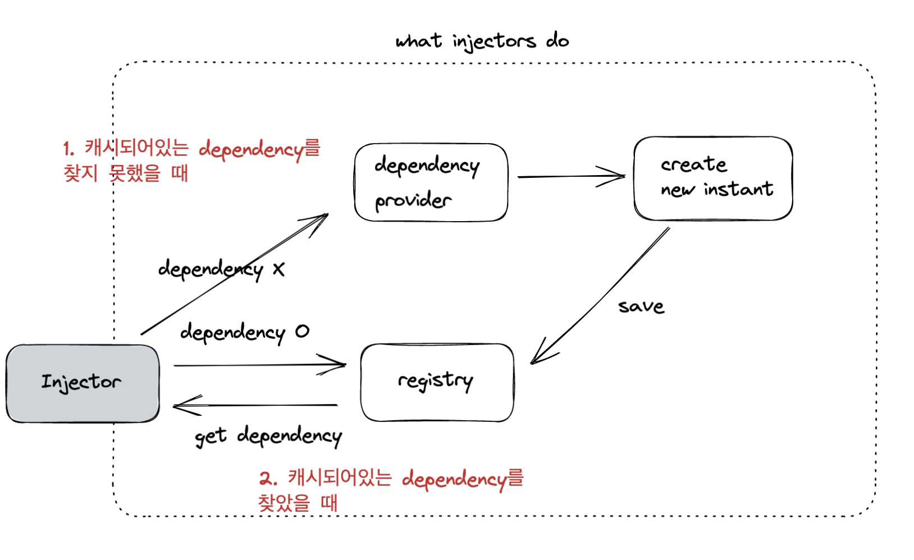
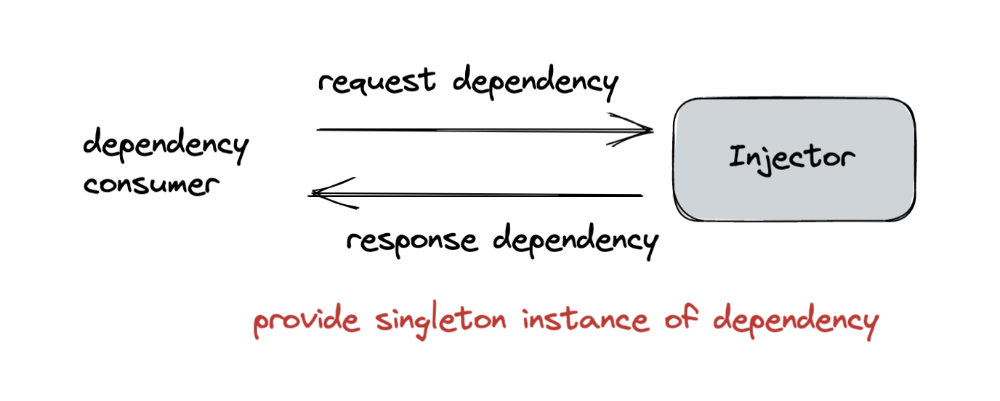
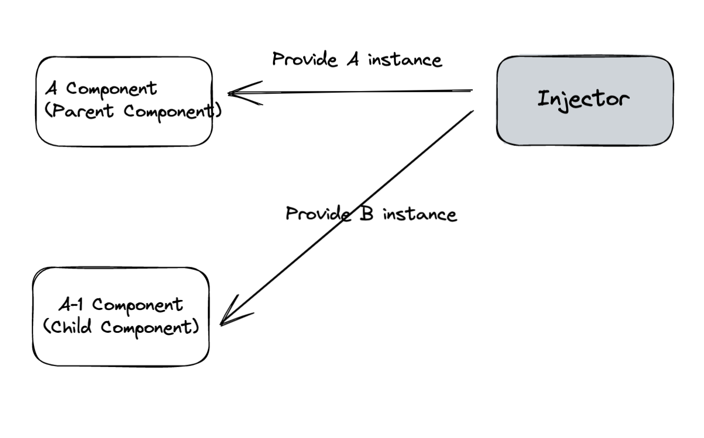

## Angular Injector & Provider

### Injector

Injector는 Angular dependency injection 시스템 내부의 객체로, Angular가 부트스트랩이 될 때 NgModules에 의해 자동으로 생성된다.

- Injector가 하는 일
  
  |1) 캐시되어있는 dependency를 찾지 못했을 때| 설정되어있는 dependency provider를 사용하여 dependency를 생성한다 |
  | :------------- |:-------------|
  |2) 캐시되어있는 dependency를 찾았을 때| 캐시되어 있는 dependency를 사용한다|

  - Injector의 특징

    1. Injector는 컴포넌트에게 dependency를 제공할 때, 싱글톤 인스턴스를 제공하며, 동일한 인스턴스를 여러 컴포넌트에 주입할 수 있다
       

    2. Injector 계층에 따라 NgModule과 컴포넌트 레벨에서 자체 컴포넌트 및 하위 컴포넌트에게 서로 다른 dependency 인스턴스를 제공할 수 있다
       

    3. 동일한 dependecy라도 서로 다른 인터페이스(구현)을 제공할 수 있는 provider를 사용하여 injector를 구성할 수 있다

### Provider

[Provider](https://angular.io/api/core/Provider) 인터페이스로 구현되어 있는 객체로, DI token과 연결된, 주입 가능한 dependency를 얻는 방법을 뜻한다. injector는 provider를 사용하여 필요로 하는 클래스에 대한 dependency의 새 인스턴스를 생성할 수 있다.  
Angular는 Angular가 정의한 서비스를 위해 모든 injector에 자체 provider를 등록한다. 응용프로그램에 필요한 서비스에 대해 자체 provdier를 등록할 수 있다
