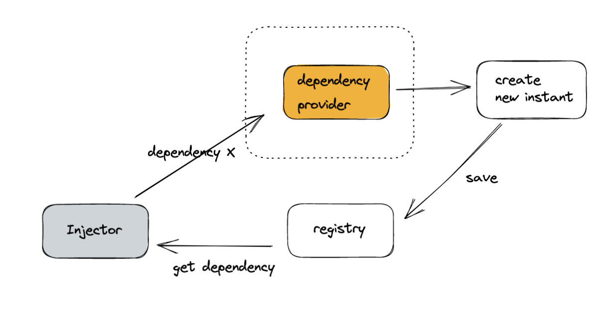

## Dependency Providers

### dependency Providing


Injector는 캐시된 인스턴스가 없는 경우, dependency provider를 통해서 새로운 인스턴스를 만든다. 그렇다면 dependency provider는 어떤 과정을 통해 dependency를 제공하는 걸까?

1. inject를 해야하는 클래스에 `@Injectable` 데코레이터를 추가한다

```
@Injectable() // 다른 클래스에 inject가 가능한 클래스임을 뜻한다
class HeroService {}
```

2. `@Injectable` 데코레이터가 있는 클래스를 제공하여 DI에서 사용할 수 있도록 한다. dependency는 여러 위치에서 사용할 수 있다

   - 컴포넌트 레벨: `@Component` 데코레이터의 `providers` 필드를 사용한다. provider된 HeroService는 이 컴포넌트의 모든 인스턴스와 템플릿에 사용되는 다른 컴포넌트 및 디렉티브에서 사용할 수 있게 된다.

   ```
   @Component({
       selector: 'hero-list',
       template: '',
       providers: [HeroService]
   })
   export class HeroListComponent {}
   ```

   컴포넌트 레벨에서 provider를 등록하면 해당 컴포넌트의 각 새 인스턴스와 함께 서비스의 새 인스턴스가 제공된다

    <br/>

   - NgModule 레벨: `@NgModule` 데코레이터의 `providers`필드를 사용한다. 모듈 레벨에서, NgModule에 정의되어 있는 파이프, 디렉티브, 컴포넌트 모두 HeroService를 사용할 수 있다

   ```
   @NgModule({
       declaration: [HeroListComponent],
       provider: [HeroService],
   })
   class HeroListModule {}
   ```

   특정한 NgModule에 provider를 등록하면, NgModule 안의 컴포넌트는 같은 인스턴스와 서비스를 사용할 수 있다

    <br/>

   - root 레벨: 애플리케이션의 다른 클래스에 주입할 수 있다. `@Injectable` 데코레이터의 `provdedIn 필드에서 'root'를 추가해주면 된다

   ```
    @Injectable({
        providedIn: 'root',
    })
    export class HeroService {}
   ```

   root 레벨에서 서비스를 제공할 때, Angular는 그 서비스를 singleton으로 생성한다. 그렇기 때문에 HeroService를 요청한 어떤 클래스에서든지 HeroService의 인스턴스가 공유된다.
   `@Injectable` 메타데이터에 provider를 등록하는 것은, Angular가 tree-shaking 하는 것을 허용하는 것이다

   - tree-shaking: 앱을 최적화하기 위해, 컴파일된 애플리케이션으로부터 사용하지 않는 서비스를 제거하는 것

<br/>

### Injecting a dependency

대부분 dependency를 주입하는 공통적인 방법은 클래스의 생성자에 정의하는 것이다. Angular는 컴포넌트, 디렉티브 또는 파이프 클래스의 새로운 인스턴스를 생성할 때, 생성자 매개변수 타입을 보고, 해당 클래스에 필요한 서비스 및 다른 서비스 또는 다른 dependency를 결정한다

```
@Component({

})
class HeroListComponent {
    consturctor(private service: HeroService) {}
}
```

Angular는 컴포넌트가 서비스에 종속되어 있음을 발견하면, 먼저 injector에 해당 인스턴스가 있는지 체크한다. 요청된 서비스 인스턴스가 아직 존재하지 않는 경우, injector는 등록된 provider를 사용하여 인스턴스를 생성하고 Angular가 서비스를 리턴하기 전에 injector에 추가한다
<br/>
요청된 모든 서비스가 해결되고 리턴되면, Angular는 해당 서비스를 인수로 사용하여 컴포넌트의 생성자를 호출할 수 있다
